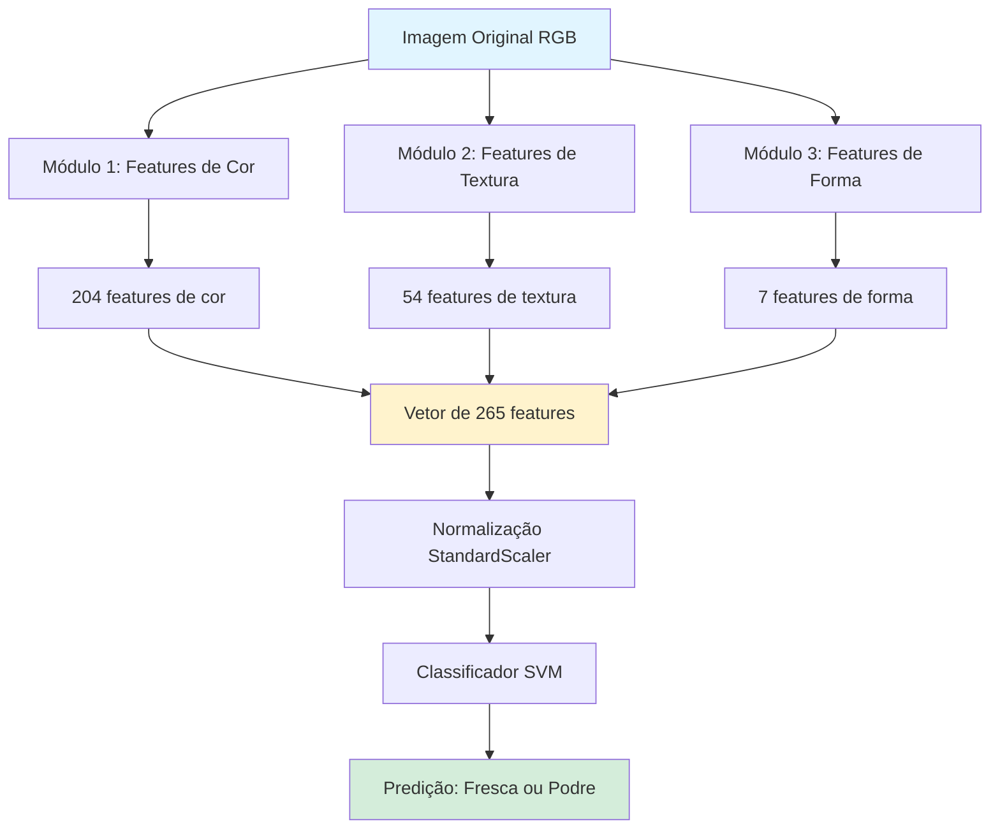

# 🔬 Pipeline de Pré-processamento e Extração de Features - Explicação Didática

## 📋 Visão Geral do Pipeline

Este documento explica **passo a passo** como funciona o pipeline de visão computacional para inspeção de qualidade de frutas, com foco no **pré-processamento e extração de características**.

---

## 🎯 Objetivo do Projeto

Classificar frutas como **FRESCAS** ou **PODRES** usando apenas técnicas de **Visão Computacional Clássica** e **Machine Learning Tradicional** (sem Deep Learning).

---

## 📊 Arquitetura do Pipeline



---

## 🔬 MÓDULO 1: Extração de Features de COR (204 features)

### 📸 **Entrada:** Imagem RGB 256x256 pixels

### **Etapa 1.1: Histogramas RGB**
- **O que faz:** Analisa a distribuição de intensidade de cada canal de cor (Vermelho, Verde, Azul)
- **Como:** Divide cada canal em 32 níveis de intensidade e conta quantos pixels existem em cada nível
- **Output:** 96 features (3 canais × 32 bins)
- **Por que é útil:** Frutas podres têm padrões de cor diferentes (mais escuras, marrons, manchas)

```
Exemplo:
- Maçã fresca: Muito vermelho intenso (histograma com picos em R alto)
- Maçã podre: Vermelho fraco + marrom (histograma distribuído, picos em valores médios/baixos)
```

### **Etapa 1.2: Conversão para HSV**
- **O que faz:** Converte a imagem de RGB para HSV (Hue-Saturation-Value)
- **Por quê:** HSV separa **cor** (H) de **brilho** (V) e **saturação** (S), facilitando a análise
  - **H (Matiz):** Qual cor predomina (vermelho, verde, amarelo, etc.)
  - **S (Saturação):** Quão "viva" ou "pálida" é a cor
  - **V (Valor/Brilho):** Quão clara ou escura é a imagem

### **Etapa 1.3: Histogramas HSV**
- **Output:** Mais 96 features (3 canais × 32 bins)
- **Vantagem:** Frutas podres perdem saturação (ficam mais pálidas) e mudam de matiz

### **Etapa 1.4: Estatísticas de Cor**
- **O que calcula:** Para cada canal (R, G, B, H, S, V):
  - Média (valor médio da cor)
  - Desvio padrão (quão variável é a cor)
- **Output:** 12 features (6 canais × 2 estatísticas)
- **Interpretação:**
  - **Desvio alto:** Muita variação de cor (pode indicar manchas/defeitos)
  - **Desvio baixo:** Cor uniforme (fruta saudável)

### ✅ **Total do Módulo 1: 204 features**

---

## 🔲 MÓDULO 2: Extração de Features de TEXTURA (54 features)

### **Etapa 2.1: Conversão para Escala de Cinza**
- **O que faz:** Remove informação de cor, mantém apenas intensidade/brilho
- **Por quê:** Textura independe de cor (casca enrugada é textura, não cor)

### **Etapa 2.2: Local Binary Pattern (LBP)**
- **O que é:** Algoritmo que detecta **padrões de textura** local
- **Como funciona:**
  1. Para cada pixel, compara com vizinhos em um raio
  2. Se vizinho for mais claro → marca como 1
  3. Se vizinho for mais escuro → marca como 0
  4. Cria um código binário que representa o padrão local
  
- **Parâmetros usados:**
  - `P=24`: analisa 24 pontos ao redor
  - `R=3`: raio de 3 pixels
  - `method='uniform'`: detecta apenas padrões uniformes (mais robustos)

- **Output:** Histograma de 26 bins (padrões de textura)
- **Interpretação:**
  - Fruta fresca: textura lisa e uniforme (poucos padrões variados)
  - Fruta podre: textura irregular (muitos padrões diferentes - rugas, manchas)

### **Etapa 2.3: Gray Level Co-occurrence Matrix (GLCM)**
- **O que é:** Mede relações espaciais entre pixels
- **Como funciona:**
  1. Analisa pares de pixels em 4 direções (0°, 45°, 90°, 135°)
  2. Calcula 5 propriedades de Haralick:
     - **Contraste:** Diferença de intensidade entre pixels adjacentes
     - **Dissimilaridade:** Quão diferentes são os pixels vizinhos
     - **Homogeneidade:** Quão uniforme é a textura
     - **Energia:** Uniformidade da distribuição
     - **Correlação:** Relação linear entre pixels

- **Output:** 20 features (5 propriedades × 4 direções)
- **Interpretação:**
  - **Alto contraste:** Superfície com variação (defeitos, manchas)
  - **Alta homogeneidade:** Superfície lisa e regular

### **Etapa 2.4: Estatísticas de Textura Básicas**
- **O que calcula:** Sobre a imagem em escala de cinza:
  - Média, desvio padrão, mínimo, máximo
  - Mediana, quartis, variância
- **Output:** 8 features
- **Uso:** Medidas simples mas eficazes de uniformidade

### ✅ **Total do Módulo 2: 54 features**

---

## 📐 MÓDULO 3: Extração de Features de FORMA e DEFEITOS (7 features)

### **Etapa 3.1: Detecção de Bordas (Canny)**
- **O que faz:** Detecta bordas e contornos na imagem
- **Como:** Algoritmo de Canny com thresholds 50 e 150
- **Métrica calculada:** **Edge Density** = quantidade de pixels de borda / total de pixels
- **Interpretação:**
  - **Edge density alto:** Muitas bordas = superfície irregular (possível defeito)
  - **Edge density baixo:** Superfície lisa

### **Etapa 3.2: Detecção de Regiões Escuras**
- **O que faz:** Identifica áreas muito escuras (threshold < 60)
- **Métrica:** Percentual de pixels escuros
- **Interpretação:** Manchas escuras geralmente indicam apodrecimento

### **Etapa 3.3: Threshold Adaptativo**
- **O que é:** Binarização que se adapta localmente às condições de iluminação
- **Como:** Compara cada pixel com a média da vizinhança
- **Métrica:** Defect score (1 - proporção de pixels brancos)
- **Uso:** Detecta irregularidades e manchas mesmo com iluminação não uniforme

### **Etapa 3.4: Análise de Gradiente (Sobel)**
- **O que faz:** Calcula a taxa de variação de intensidade (quão rápido a cor muda)
- **Como:** 
  1. Aplica filtro Sobel em X (horizontal)
  2. Aplica filtro Sobel em Y (vertical)
  3. Calcula magnitude: √(Sobel_x² + Sobel_y²)
- **Métricas:** Média e desvio padrão do gradiente
- **Interpretação:**
  - **Gradiente alto:** Bordas acentuadas, superfície irregular
  - **Gradiente baixo:** Transições suaves, superfície uniforme

### **Etapa 3.5: Estatísticas de Bordas**
- Média e desvio padrão da imagem de bordas (Canny)

### ✅ **Total do Módulo 3: 7 features**

---

## 🔗 CONCATENAÇÃO E NORMALIZAÇÃO

### **Etapa 4: Concatenação do Vetor de Features**
```
[204 features de cor] + [54 features de textura] + [7 features de forma]
= 265 features totais
```

### **Etapa 5: Normalização (StandardScaler)**
- **O que faz:** Padroniza todas as features para terem média 0 e desvio padrão 1
- **Por quê:** Features têm escalas muito diferentes (ex: média RGB pode ser 0-255, edge density é 0-1)
- **Fórmula:** `z = (x - média) / desvio_padrão`
- **Importância:** Modelos de ML funcionam melhor com dados normalizados

---

## 🤖 CLASSIFICAÇÃO (Machine Learning)

### **Modelo Escolhido:**

#### **SVM (Support Vector Machine)**
- **O que é:** Um algoritmo que encontra a melhor "linha" (hiperplano) para separar as frutas frescas das podres.
- **Por que SVM?**
  - Funciona muito bem com vetores de características (como nosso vetor de 265 features).
  - É robusto e eficaz para classificação binária.
  - Usamos o **Kernel RBF** (Radial Basis Function), que permite separar classes que não são linearmente separáveis (ou seja, quando uma linha reta não basta).

### **Treinamento:**
1. Split 80/20 (treino/teste)
2. Normalização com StandardScaler (fit no treino, transform no teste)
3. Treinamento do modelo SVM
4. Avaliação: acurácia, precisão, recall, F1-score

---

## 📊 VISUALIZAÇÕES GERADAS

### **1. Pipeline de Extração**
- Imagem original
- Canais HSV separados
- LBP (textura)
- Bordas (Canny)
- Regiões escuras
- Threshold adaptativo
- Gradiente
- Histogramas RGB e HSV

### **2. Resultados da Classificação**
- Top 5 predições com probabilidades
- Decisão final (FRESCA vs PODRE)
- Confiança da predição

### **3. Métricas do Modelo**
- Matriz de confusão
- Precisão, Recall, F1-Score por classe
- Distribuição de confiança

---

## 💡 RESUMO DO FLUXO

1. **Imagem entra** (RGB 256x256)
2. **Extração paralela:**
   - COR: histogramas RGB + HSV + estatísticas → 204 features
   - TEXTURA: LBP + GLCM + estatísticas → 54 features
   - FORMA: bordas + defeitos + gradientes → 7 features
3. **Concatenação:** vetor de 265 features
4. **Normalização:** StandardScaler
5. **Classificação:** SVM
6. **Output:** Classe + confiança

---

## ✅ PONTOS FORTES DO CÓDIGO

- ✅ Pipeline bem estruturado e modular
- ✅ Combinação robusta de features (cor, textura, forma)
- ✅ Visualizações detalhadas para apresentação
- ✅ Modelo SVM robusto e bem calibrado
- ✅ Normalização adequada dos dados
- ✅ Métricas completas de avaliação

---

## 🔧 SUGESTÕES DE MELHORIA

### **1. Expandir Features de Textura**
- Adicionar Gabor Filters (detecta padrões direcionais)
- Wavelets (análise multi-escala)

### **3. Features Específicas de Defeitos**
- Detecção de manchas circulares (Hough Circles)
- Análise de simetria (frutas podres perdem simetria)
- Contagem de regiões conectadas (número de manchas)

### **4. Melhorar Visualizações**
- Adicionar setas mostrando o fluxo entre etapas
- Destacar regiões de defeito na imagem original
- Criar GIF animado do pipeline

### **5. Data Augmentation**
- Rotação, flip, zoom
- Ajuste de brilho/contraste
- Melhora generalização do modelo

### **6. Cross-Validation**
- Usar K-Fold para avaliação mais robusta
- Evitar overfitting em uma única divisão treino/teste

---

## 📚 Para a Apresentação

### **Roteiro Sugerido:**

1. **Introdução (2 min)**
   - Problema: inspeção manual é lenta e cara
   - Solução: visão computacional + ML

2. **Pipeline de Extração (5 min)**
   - Mostrar imagem original
   - Explicar cada módulo com exemplos visuais
   - Destacar por que cada feature é relevante

3. **Visualizações (3 min)**
   - Mostrar saída do pipeline em imagem real
   - Comparar fruta fresca vs podre

4. **Resultados (3 min)**
   - Métricas do modelo
   - Casos de sucesso e falha
   - Confiança das predições

5. **Conclusão (2 min)**
   - Resumo
   - Limitações
   - Trabalhos futuros

---

## 📖 Glossário Técnico

- **Feature:** Característica numérica extraída da imagem
- **Histograma:** Distribuição de frequência de valores
- **LBP:** Padrão binário local (textura)
- **GLCM:** Matriz de co-ocorrência (relações espaciais)
- **Gradiente:** Taxa de mudança de intensidade
- **Threshold:** Limiar para binarização
- **StandardScaler:** Normalização estatística (z-score)

---

**Criado para:** Projeto de Visão Computacional - Classificação de Frutas  
**Autor:** Reinan Amaral  
**Data:** Novembro 2024
